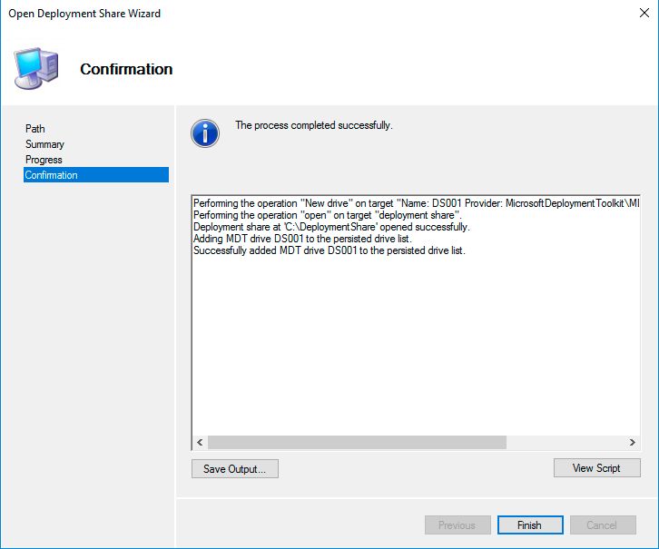
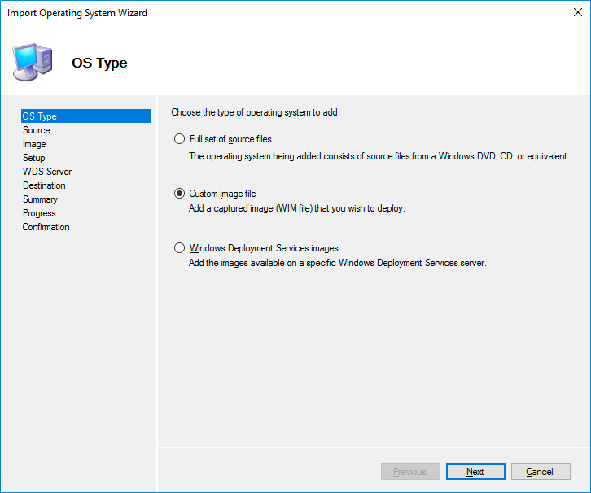
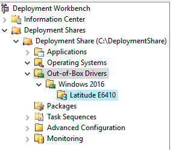
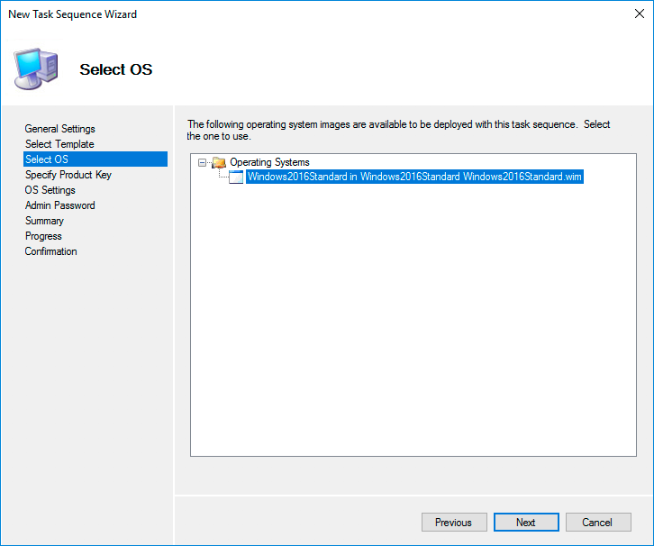

* Once the Packer image has created there will be a `.box` in the `PackerTemplates` directory. This contains a `.vhdx` file that we can use as a deployment image in MDT.
* Install 7zip so we can extract the `.box` file.

```
choco install 7zip -y
```

* Extract the `.box` file with 7zip:
```
# Un-compress the file
7z x .\win2016stsd-wmf-nocm-hyperv.box

# Extract the contents - you have to do this because of a weird 7zip thing.
7z x .\win2016stsd-wmf-nocm-hyperv

# Remove the un-compressed file
Remove-Item -Path .\win2016stsd-wmf-nocm-hyperv
```

* You will now have a folder called `Virtual Hard Disks` with a `.vhdx` inside.
* Back in the MDT Deployment Workbench right click on `Deployment Share` and choose `Open Deployment Share`. Enter `C:\DeploymentShare` and finish the wizard.



We now need to obtain the `.wim` file from our `.vhdx` file. From a Windows machine, run the following commands:

```powershell
# Mount the VHDX
New-Item -ItemType Directory -Path 'C:\VHDMount' -Force

Mount-WindowsImage -ImagePath 'X:\Virtual Hard Disks\win2016std-base.vhdx' -Index 1 -Path 'C:\VHDMount'

# Capture the WIM file from the Packer Image
New-Item -ItemType Directory -Path 'C:\CapturedWIMs' -Force

New-WindowsImage -CapturePath C:\VHDMount -Name 'Windows2016Standard' -ImagePath 'C:\CapturedWIMs\Windows2016Standard.wim' -Description "Windows 2016 Created by Packer" -Verify

# Dismount the image
Dismount-WindowsImage -Path C:\VHDMount -Discard
```

Once the capture is complete, you will have a `.wim` file which we can import into the MDT Deployment Workbench.

* Choose `Operating Systems` and then `Import Operating System`.



* For source file choose the `.wim`
* Choose `Setup files are not needed`
* Finish the rest of the wizard
* Right click on `Deployment Share` and choose `Update Deployment Share`

* Install Drivers
* Download the `.cab` file which contains the driver for your hardware. In my case this was `E6410-win7-A11-D2H6P.CAB`.
* Create a folder for the operating system you will be installing `Windows 2016`.
* Find out the model name of the machine you are install drivers for by running the `wmic computersystem get model` command. In my case it returned `Latitude E6410`.



* Lay out your drivers according to the model number.

* Right click on `Out-of-Box Drivers` and choose `Import Drivers`. Choose the source directory that contains your `.cab` file and the Deployment Workbench will extract your `.cab` file and import the drives. Make sure the drivers go into the correct folder for your model number.

* Create a task sequence

* Right click on `Task Sequences` and choose `New Task Sequence`. Enter an id and a task sequence name.
* As we are using Windows 2016, choose `Standard Server Task Sequence`
* Selet the OS, as we only have one option, choose Windows 2016.



Once the task seqence has been saved, right click on it and choose `Properties`

* Do what it says in step 3 here: https://deploymentresearch.com/Research/Post/325/MDT-2013-Lite-Touch-Driver-Management


