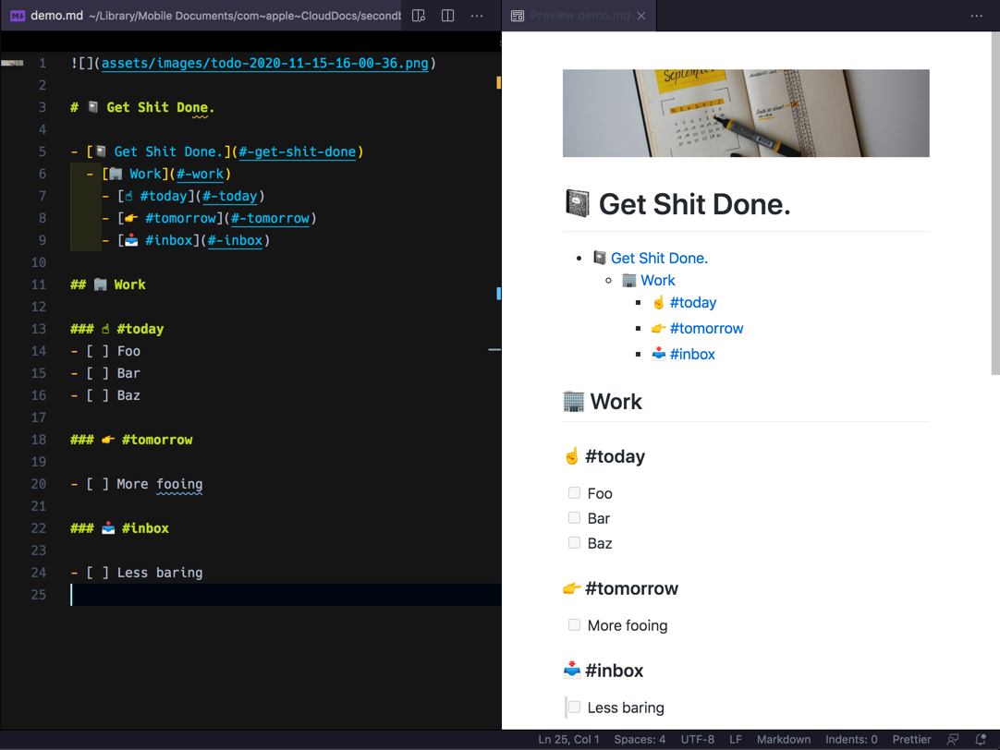
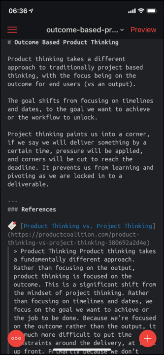

I have been diving into the topic of a "[second brain](https://fortelabs.co/blog/basboverview/)", a method of saving and linking  our ideas, insights and thoughts. I was interested in this for a few reasons:

- To assist in active reading. I've read a lot of books and blog posts which often resinate with me. One week later i've forgotten the advice or ideas that the reading inspired. I wanted to reduce the amount of reading I was doing, while increasing the value I was getting out of it.

- To act as a personal knowledge base of things I was researching or working on (eg. personal electronics projects or [home automation](https://hodgkins.io/securing-home-assitant-with-cloudflare)).

- To improve my thinking by linking thoughts, concepts and subjects together. This was inspired by reading about the [Zettelkasten Method](https://zettelkasten.de/posts/overview/).

- A large part of my job as an engineering lead is understanding many complex problems, and trying to write a roadmaps on how my team aims to solve them. I wanted to improve my ability to distill complex topics down into written plans in [plain english](http://www.plainenglish.co.uk/how-to-write-in-plain-english.html) so they were easily consumable.

- Cut down on [open loops](https://habitgrowth.com/open-loops/) (commitments I made to myself or someone else that I haven't done yet) in my brain. I would do this by writing down ideas or to do's as soon as they popped into my head.

This post shares takes a look at some of the tools, workflows and observations i've discovered along the way.

- TOC
{:toc}


## 🔧 Tools

Based on my research there were many tools that people were using for capturing their knowledge such as [Roam Research](https://roamresearch.com/), [The Archive](https://zettelkasten.de/the-archive/), [Obsidian](https://obsidian.md/), [Foam](https://foambubble.github.io/), [Dendron](https://www.dendron.so/) and [Notion](https://www.notion.so/).

I had a set of my own requirements for the tool I wanted to use:

- I *must* own the files in my knowledge archive, and be able to interact with them on disk
- I *must* be able to interact with my knowledge base offline
- I *must* be work on my second brain from my laptop or iPhone
- The tool *should* be open source

Of all the tools I tried, [Foam](https://foambubble.github.io/) came the closet to what I chose. It's a simple tool, just a [VS Code](https://code.visualstudio.com/) extension that brings in a few other plugins for working with markdown documents.

The advantage was VSCode was already my editor of choice, so I was already efficient with using it. Foam gave me the inspiration to piece together my own VS Code Second brain based on plugins that already existed.

Below is a list of the plugins I now use for my VSCode Second Brain, with some of the main features they provide.

## 🔌 VSCode Extensions

### Markdown All in One

- Plugin Link: [yzhang.markdown-all-in-one](https://marketplace.visualstudio.com/items?itemName=yzhang.markdown-all-in-one)
- GitHub: [yzhang-gh/vscode-markdown](https://github.com/yzhang-gh/vscode-markdown)

**Features:**

  - Automatically completes / continues lists
  - Mark one or many to do list items done with a shortcut (`option+c`)


  - Creating a table of contents based on markdown headers
  - Format's markdown tables so they are readable
  - When you have a URL on your clipboard, select text and paste over the top to create a markdown link


### Markdown Checkboxes

- Plugin Link: [bierner.markdown-checkbox](https://marketplace.visualstudio.com/items?itemName=bierner.markdown-checkbox)
- GitHub: [mjbvz/vscode-markdown-checkboxes](https://github.com/mjbvz/vscode-markdown-checkboxes)

**Features:**

  - Adds to do checkboxes to VSCode markdown preview

### Markdown Preview Github Styling

* Plugin Link: [bierner.markdown-preview-github-styles](https://marketplace.visualstudio.com/items?itemName=bierner.markdown-preview-github-styles)
* GitHub: [mjbvz/vscode-github-markdown-preview-style](https://github.com/mjbvz/vscode-github-markdown-preview-style)



**Features:**

  - Makes the VSCode markdown preview look like it would on GitHub

### Markdown Memo svsool.markdown-memo

- Plugin Link: [svsool.markdown-memo](https://marketplace.visualstudio.com/items?itemName=svsool.markdown-memo)
- GitHub: [svsool/vscode-memo](https://github.com/svsool/vscode-memo)

**Features:**

  - Navigate notes in the VSCode using wikilinks (`[[link]]`) to create links between your notes
  - `option+click` on a link with no note created for that link will automatically create the file and open it. This is one method to quickly create new notes on the fly.
  - Support clickable wikilinks in markdown preview
  - Automatic renaming of links when you change the name of markdown files

### Paste Image

- Plugin Link: [mushan.vscode-paste-image](https://marketplace.visualstudio.com/items?itemName=mushan.vscode-paste-image)
- GitHub: [mushanshitiancai/vscode-paste-image](https://github.com/mushanshitiancai/vscode-paste-image)

**Features:**

  - Enables using the `> Paste Image` in the command pallet to paste into the markdown document from clipboard. The image is then saved to the file system.

**Recommended Settings:**

- Change the location of where images are stored with automatic naming by adding this a `.vscode/settings.json`:
```json
{
    "pasteImage.defaultName": "${currentFileNameWithoutExt}-Y-MM-DD-HH-mm-ss",
    "pasteImage.path": "${projectRoot}/assets/images"
}
```

### Markdown Links

* Plugin Link: [tchayen.markdown-links](https://marketplace.visualstudio.com/items?itemName=tchayen.markdown-links)
* GitHub: [tchayen/markdown-links](https://github.com/tchayen/markdown-links)

**Features:**

  - Uses the links (the relationships between your notes) to display a graph. This allows for exploring how ideas or topics are connected visually.


### Emoji

- Plugin Link: [perkovec.emoji](https://marketplace.visualstudio.com/items?itemName=perkovec.emoji)
- GitHub: [Perkovec/Emoji](https://github.com/Perkovec/Emoji)

**Features:**

  - Enables using `> Emoji: Insert Emoji` to search for and insert emojis in your markdown ✨


### Markdown-link-expander

- Plugin Link: [skn0tt.markdown-link-expander](https://marketplace.visualstudio.com/items?itemName=skn0tt.markdown-link-expander)
- GitHub: [Skn0tt/markdown-link-expander](https://github.com/Skn0tt/markdown-link-expander)

**Features:**

  - When you paste a markdown link, it can lookup its title and insert it into the document. This is create for linking to references or the source of ideas for your notes.


### VSNotes

- Plugin Link: [patricklee.vsnotes](https://marketplace.visualstudio.com/items?itemName=patricklee.vsnotes)
- GitHub: [patleeman/VSNotes](https://github.com/patleeman/VSNotes)

**Features:**

  - Allows quickly creating new notes based on templates. For example you might create a new note per meeting or per idea, and have a certain template for each note type.


**Recommended Settings:**

- Change the file name for all new notes in `.vscode/settings.json`:

```json
{
    "vsnotes.noteTitleConvertSpaces": "-",
    "vsnotes.tokens": [
        {
            "type": "datetime",
            "token": "{dt}",
            "format": "YYYYMMDDHHmm",
            "description": "Insert formatted datetime."
        },
        {
            "type": "title",
            "token": "{title}",
            "description": "Insert note title from input box.",
            "format": "Untitled"
        },
        {
            "type": "extension",
            "token": "{ext}",
            "description": "Insert file vsnotes.",
            "format": "md"
        }
    ]
}
```

- Create a [VSCode Snippet](https://code.visualstudio.com/docs/editor/userdefinedsnippets) called `Header` which will be the default template inserted into a new note.

```json
{
	"Header": {
		"scope": "markdown",
		"prefix": "head",
		"body": [
			"---",
			"id: '${CURRENT_YEAR}${CURRENT_MONTH}${CURRENT_DATE}${CURRENT_HOUR}${CURRENT_MINUTE}'",
			"tags: []",
			"related: []",
			"from:",
			"---",
			"",
			"# ${1:title}",
		],
		"description": "The default note template"
	}
}
```

- Tell VSNodes the name of the snippet to use when new notes are created in `.vscode/settings.json`:

```json
{
    "vsnotes.defaultSnippet": {
        "langId": "markdown",
        "name": "Header"
    }
}
```

- Add a new shortcut to `keybindings.json` to allow quickly creating new notes

```json
[
    {
        "key": "alt+shift+n",
        "command": "vsnotes.newNote",
    },
]
```

### Quick Extension Setup

If you want a quick way to setup extensions:

- Create a directory that contains your second brain (say `/~secondbrain`)
- Inside that directory, drop in a `.vscode/extensions.json` file in it that contains all the extensions you want installed:

```json
{
  "recommendations": [
    "bierner.markdown-checkbox",
    "bierner.markdown-preview-github-styles",
    "mushan.vscode-paste-image",
    "perkovec.emoji",
    "skn0tt.markdown-link-expander",
    "svsool.markdown-memo",
    "tchayen.markdown-links",
    "yzhang.markdown-all-in-one",
    "patricklee.vsnotes",
  ]
}
```

- VSCode will prompt you with recommended extensions when you open that directory.

## 📱 Editing Markdown on iOS

To make sure I could make notes or add to do's when I was on the go, I needed a way to work with the markdown documents on my iPhone.

[1Writer](https://1writerapp.com/) was the app I choose:

- Wikilinks, including creating new notes from them if they don't exist works
- It has a shortcut bar with lots of most the actions when working with markdown
- It supports syncing using iCloud or Dropbox, allowing to edit on my laptop or phone
- It's possible to automate using [iOS URL Scheme](https://1writerapp.com/docs/urlscheme) and even [Javascript](https://1writerapp.com/docs/js)
- It has a clean and simple editing and preview view with several customization options




## 🗣 High Level Workflow

My workflow on using this system is fairly simple:

- When I read or learn something I summarize it in 1 or 2 paragraphs and create a note
- I have a think about other topics and try and relate it to other ideas i've taken notes about
- When I have meetings or technical discussions, I offer to be the note taker. At breaks in the flow of the discussion i'll read my summary to the people in the meeting to see I summarized correctly
- I spend a few times a week going through notes, tidying them up and thinking about what I wrote down. I try and link it to other topics or ideas, or write down new ideas
- Every time I think of something when I am away from my laptop, I add it to  my `todo.md` or `inbox.md` (ideas / thoughts). I think go and process these lists at the start of each day

## 🤔 Impact

I've noticed several positive things in my first few weeks of using this system.

- I am able to very quickly pull up information from previous discussions, or find documents I have read based on the references I am making. I just do a search VSCode and can pull up the relevant information. I deal with a lot of documents, and this saving me a lot of minutes each day.
- My stress levels feel lower, as I am not constantly thinking about all the things I have to do. I know that it is safely stored and I can find it easily.
- I've always considered myself as "not great" at coming up with ideas or visions for the future of what we should do or build at work. I've had 2 cases in the last few weeks where i've had an "AHA!" moment just randomly. I am not sure if it is because my brain is clear, or because the complex information is laid out in a way that is easier for me to comprehend, but so far this seems to be improving.
- I am reading less articles or blogs due the barrier of entry of forcing myself to make notes about them. I'm not sure if this is a bad or a good thing just yet.
- This blog post was actually written based on a note I was taking to track all my VSCode extensions and what they did. It's handy being able to spin my thoughts easily out into blog posts.

## Conclusion

So far my experiment with using VSCode as a *second brain* has been fairly successful. I can see myself sticking the workflow for a while and tweaking the workflow based on things I discover.

The next thing I want to work on is a way to dictate notes to my Apple Watch when I am out on a bike ride and have them be inserted into my `inbox.md`. It's always the places that it's hard to take notes where you come up with the ideas. 🚿
